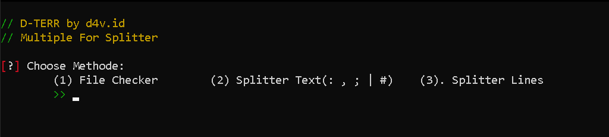
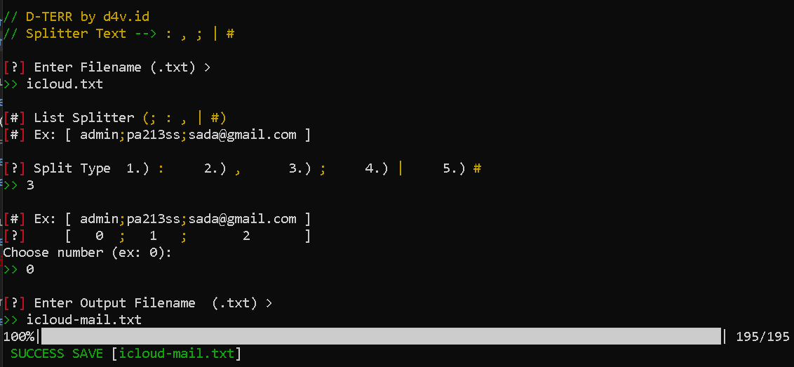
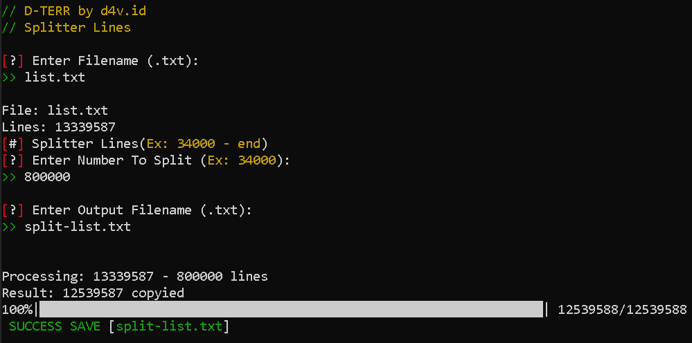

# // (D-TERR) Splitter-List-Line-Text 
<b>ENGLISH</b>
Multiple for Splitter file(List) is a line or character (; : , | #) until it becomes two files and can split of lines, sentences, and words that are in a file "List"

Fitur/Features:
- Split Line
- Split (; : , | #) Character
- Checker File Words,Sentences,lines



### Install
Python3 (Version)
```bash
 $ python -m pip install colorama
 $ python -m pip install tqdm
```

### Images
#### Split Character (; : , | #)




#### Split Lines



# Support/Contact
d4vbusiness@gmail.com (Gmail)
